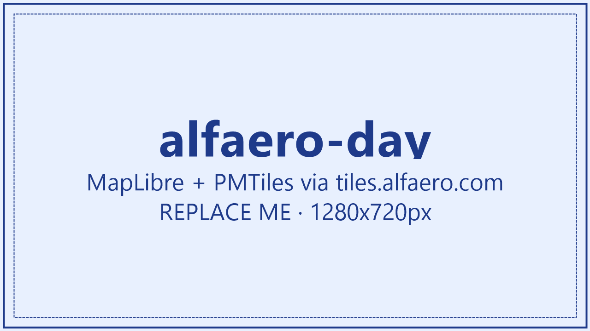
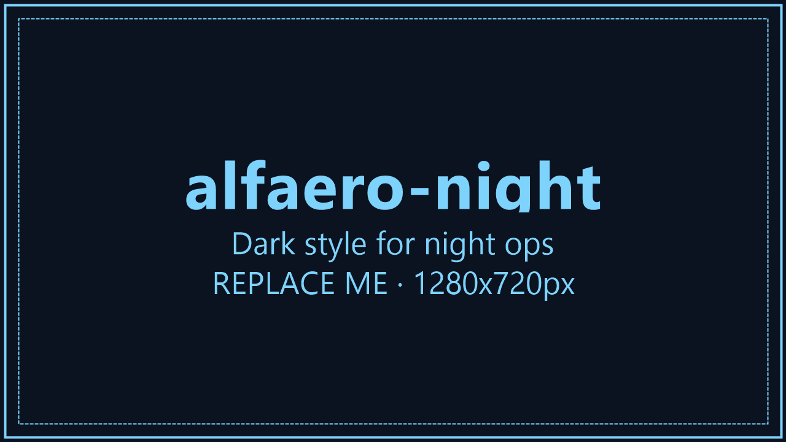
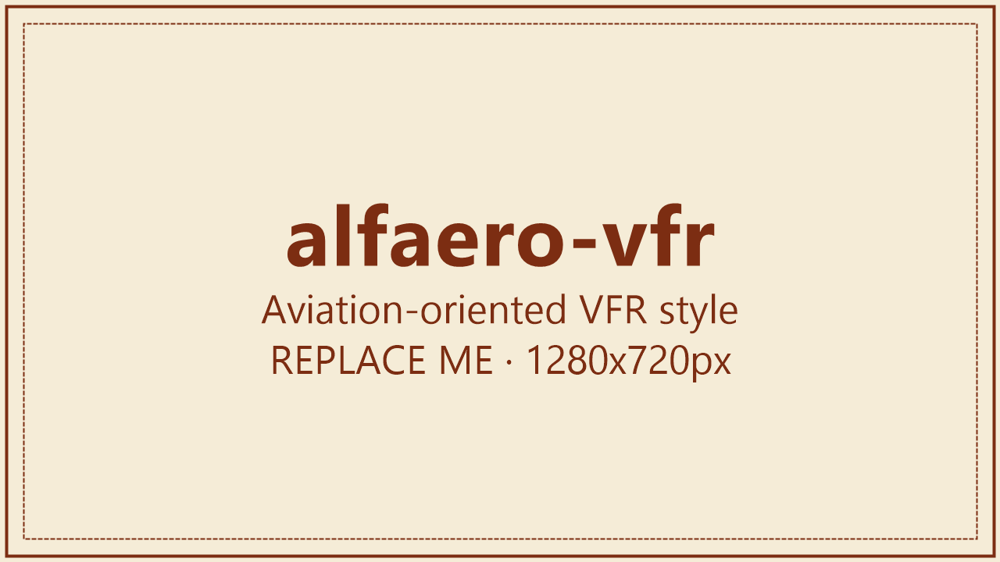

<div align="center">

# Alfaero Map Tiles

**Self-hosted vector map tiles for your apps — worldwide OpenStreetMap coverage, served from your own infrastructure for a flat ~$40/month, with zero per-request billing.**

[](https://maplibre.org/)
[](https://protomaps.com/docs/pmtiles)
[](https://developers.cloudflare.com/r2/)
[](https://www.terraform.io/)
[](LICENSE)

</div>

---

Alfaero Map Tiles replaces paid map providers (Mapbox, Google Maps, MapTiler) with a
**self-hosted vector tile stack** built on
[OpenFreeMap](https://openfreemap.org/),
[PMTiles](https://protomaps.com/docs/pmtiles),
[Cloudflare R2](https://developers.cloudflare.com/r2/) and the
[Cloudflare CDN](https://developers.cloudflare.com/cache/).

It serves **`tiles.alfaero.com`** with worldwide planet OSM coverage, refreshed weekly, and is
consumed by every Alfaero client (mobile, operator, vip-web, b2b, backoffice) through
[MapLibre](https://maplibre.org/). Because R2 has **no egress fees** and the CDN absorbs reads,
the bill is essentially flat regardless of traffic.

## Screenshots

> ⚠️ The images below are **placeholders**. Drop real captures over the files in
> [`doc/screenshots/`](doc/screenshots) (same filenames) to update this section.

| `alfaero-day` | `alfaero-night` | `alfaero-vfr` |
|:---:|:---:|:---:|
|  |  |  |
| Neutral light UI theme | Dark cockpit / night theme | Aviation-oriented VFR theme |

## Architecture

```
                         ┌──────────────────────────────────────────────┐
   MapLibre clients       │  Cloudflare CDN  (tiles.alfaero.com)         │
   (mobile / web /   ───► │  Cache Reserve ON · Tiered Cache · 30d edge  │
    operator / b2b)       └───────────────┬──────────────────────────────┘
        │ HTTPS range requests            │ cache miss
        ▼                                 ▼
   pmtiles:// protocol          ┌─────────────────────────────┐
   (single-file vector map)     │ Cloudflare Worker            │
                                │ (Protomaps tiles-worker)     │
                                │  range-reads the PMTiles     │
                                └───────────────┬──────────────┘
                                                ▼
                                ┌─────────────────────────────┐
                                │  R2 bucket: alfaero-map-tiles│
                                │   planet-{YYYY}wWW.pmtiles   │
                                │   styles/{day,night,vfr}.json│
                                │   sprites/alfaero/  ·  fonts/│
                                └─────────────────────────────┘

   Weekly refresh (AWS Step Functions → EC2 spot → pipeline/01..06):
     01 download  →  02 convert (mbtiles→pmtiles)  →  03 upload (R2)
        →  04 publish styles  →  05 purge CDN  →  06 cleanup
```

A parallel **self-hosted [TileServer GL](https://github.com/maptiler/tileserver-gl)** deployment
(`infrastructure/tileserver/`) serves the raster **aeronautical charts** as XYZ tiles, using the
`*-xyz.json` style variants — complementary to the PMTiles basemap.

## What's implemented

- 🌍 **Worldwide vector basemap** — the OpenStreetMap planet as a single `planet-{week}.pmtiles`
  file on R2, addressed directly by clients via the `pmtiles://` protocol.
- ⚡ **Edge-cached delivery** — Cloudflare CDN with Cache Reserve + Tiered Cache in front of a
  [Protomaps Cloudflare Worker](https://docs.protomaps.com/deploy/cloudflare) that range-reads the
  PMTiles from R2. No origin server to run.
- 🎨 **Three first-party MapLibre styles** — `alfaero-day`, `alfaero-night`, `alfaero-vfr`
  (+ `*-xyz.json` variants for the self-hosted tileserver), editable visually in
  [Maputnik](https://maplibre.org/maputnik/).
- 🔁 **Fully automated weekly refresh** — six idempotent shell steps orchestrated by
  `pipeline/run-update.sh`, designed to run on an AWS EC2 spot instance launched by Step Functions,
  with optional Slack notifications.
- 🧱 **Infrastructure as Code** — Terraform provisions R2, the Cloudflare custom domain + cache
  rules, and the AWS pipeline (`terraform/{r2,cloudflare,aws,main,variables}.tf`).
- 🖼️ **Custom sprites & fonts** — Alfaero icon sprite sheet and glyph PBFs (fontnik) served from R2.
- 🔌 **Ready-made client integrations** — copy-paste snippets for Flutter, React, and Laravel Blade
  in `docs/integration-snippets/`, plus an offline path via the companion
  [`alfa_vector_mbtiles`](https://pub.dev/packages/alfa_vector_mbtiles) Flutter package.
- 📊 **Benchmark harness** — `benchmark/` HTML page + script to validate tile latency and cache hit ratio.

## Repository layout

| Path | What's inside |
|---|---|
| `pipeline/` | Weekly job: `01-download` → `02-convert` → `03-upload` → `04-publish-style` → `05-purge-cdn` → `06-cleanup`, plus `run-update.sh` orchestrator. |
| `terraform/` | IaC for R2, Cloudflare (custom domain + cache rules) and AWS (Step Functions + EC2 spot). |
| `styles/` | MapLibre style JSONs: `alfaero-{day,night,vfr}.json` (+ `*-xyz.json` for the tileserver). Templates — `PLACEHOLDER` is replaced with the live PMTiles version at publish time. |
| `sprites/alfaero/` | Custom icon sprite sources + generated sheets. |
| `fonts/` | Glyph PBFs generated with fontnik. |
| `infrastructure/tiles-worker/` | Protomaps Cloudflare Worker (Wrangler project) that fronts the PMTiles on R2. |
| `infrastructure/tiles-worker-shared/` | Shared worker logic + unit tests. |
| `infrastructure/tileserver/` | Self-hosted TileServer GL (Docker Compose) + admin daemon for raster aeronautical charts. |
| `infrastructure/cache-rules/`, `infrastructure/ec2-job/`, `infrastructure/github-actions/` | Cache-rule apply script, EC2 user-data bootstrap, and a manual GitHub Actions trigger. |
| `benchmark/` | Latency/cache benchmark page and script. |
| `docs/` | Flutter & web integration guides, operations runbook, style customization, and integration snippets. |

## The weekly pipeline

```bash
# Runs on the EC2 spot instance (env injected via user-data / .env):
#   R2_ACCESS_KEY_ID, R2_SECRET_ACCESS_KEY, R2_ENDPOINT, R2_BUCKET
#   CF_API_TOKEN, CF_ZONE_ID_ALFAERO, TILES_DOMAIN
#   SLACK_WEBHOOK_URL (optional)
bash pipeline/run-update.sh
```

1. **`01-download`** — `rclone` the latest planet `mbtiles` from OpenFreeMap.
2. **`02-convert`** — `pmtiles convert` the mbtiles into `planet-{YYYY}wWW.pmtiles`.
3. **`03-upload`** — `rclone` the PMTiles to the R2 bucket.
4. **`04-publish-style`** — stamp the live PMTiles version into the style JSONs and upload them.
5. **`05-purge-cdn`** — purge the Cloudflare cache for the styles so clients pick up the new version.
6. **`06-cleanup`** — prune old PMTiles versions, keeping the last N.

## Styles

The three styles all point at the `openmaptiles` source (`pmtiles://https://tiles.alfaero.com/...`):

| Style | Use |
|---|---|
| `alfaero-day` | General UI (web, light mobile) — neutral light palette, Alfaero-orange motorways. |
| `alfaero-night` | Dark mode / night cockpit — dark blue-tinted background, high contrast. |
| `alfaero-vfr` | Aviation VFR — emphasized terrain (green/brown), visible runways, muted urban fabric. |

> The committed styles are **templates** (they contain `planet-PLACEHOLDER.pmtiles`). In production,
> always fetch from `https://tiles.alfaero.com/styles/...` — the pipeline stamps the live version.

## Quick start (operators)

See [`docs/operations.md`](docs/operations.md) for the full runbook. In short:

1. Fill in Cloudflare + AWS + R2 credentials in `.env` (copy from `.env.example`).
2. `cd terraform && terraform apply` — creates the R2 bucket, custom domain, cache rules and the AWS pipeline.
3. Deploy the Protomaps worker in `infrastructure/tiles-worker/` (`wrangler deploy`).
4. Trigger the pipeline once to generate the first `planet-{...}.pmtiles`.
5. Validate latency/cache with `benchmark/`.
6. Migrate clients — see [`docs/integration-flutter.md`](docs/integration-flutter.md) and
   [`docs/integration-web.md`](docs/integration-web.md).

## Client integration

| Target | How |
|---|---|
| **Flutter (online)** | `maplibre_gl` pointed at `https://tiles.alfaero.com/styles/alfaero-day.json` — see [`docs/integration-flutter.md`](docs/integration-flutter.md). |
| **Flutter (offline)** | Companion package [`alfa_vector_mbtiles`](https://pub.dev/packages/alfa_vector_mbtiles) renders a bundled `.mbtiles` with no network. |
| **Web (React / vanilla)** | MapLibre GL JS + the `pmtiles` protocol — see [`docs/integration-web.md`](docs/integration-web.md) and `docs/integration-snippets/`. |
| **Laravel Blade** | `docs/integration-snippets/laravel-blade-map.blade.php`. |

## Cost

| Item | Estimate |
|---|---|
| R2 storage (~250 GB, 2 versions) | ~$4/mo |
| R2 reads (~80M tiles/mo) | ~$30/mo |
| Egress | **$0** (R2 has no egress fees) |
| AWS pipeline (weekly EC2 spot) | ~$5/mo |
| **Total** | **~$40/mo, flat** |

## Required attribution

Per the OSM / OpenMapTiles / OpenFreeMap licenses, every client **must** display:

> © OpenFreeMap © OpenMapTiles © OpenStreetMap

MapLibre renders this automatically via its `AttributionControl` — **do not remove it.**

## Security note (before going public)

This repo currently contains operational state that must **never** be committed to a public
repository — verify they are git-ignored and scrubbed from history before publishing:

- `terraform/terraform.tfstate*`, `terraform/tfplan`, `terraform/terraform.tfvars`
- `terraform/.terraform/` provider binaries
- `infrastructure/tiles-worker/node_modules/`, real `wrangler.toml`
- any real values in `.env`

Run a secret scan (e.g. `gitleaks`) over the full history first.

## License

[MIT](LICENSE). External data and styles keep their own licenses — keep the attribution above visible.
